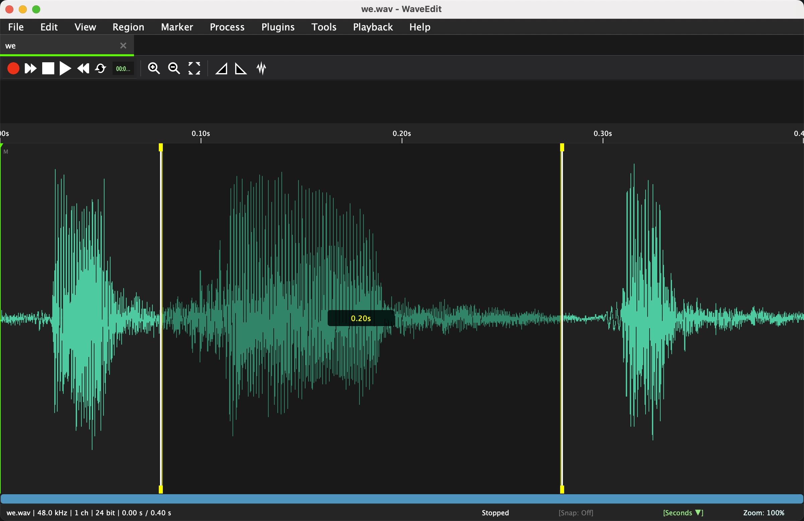
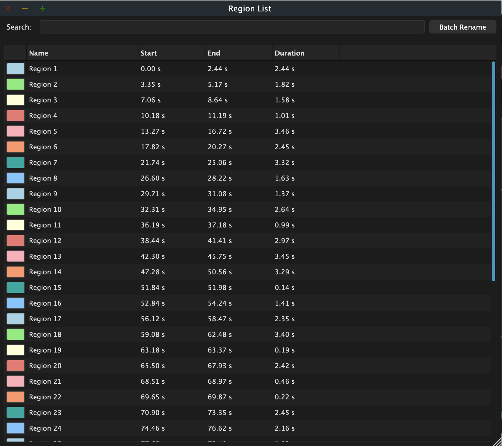
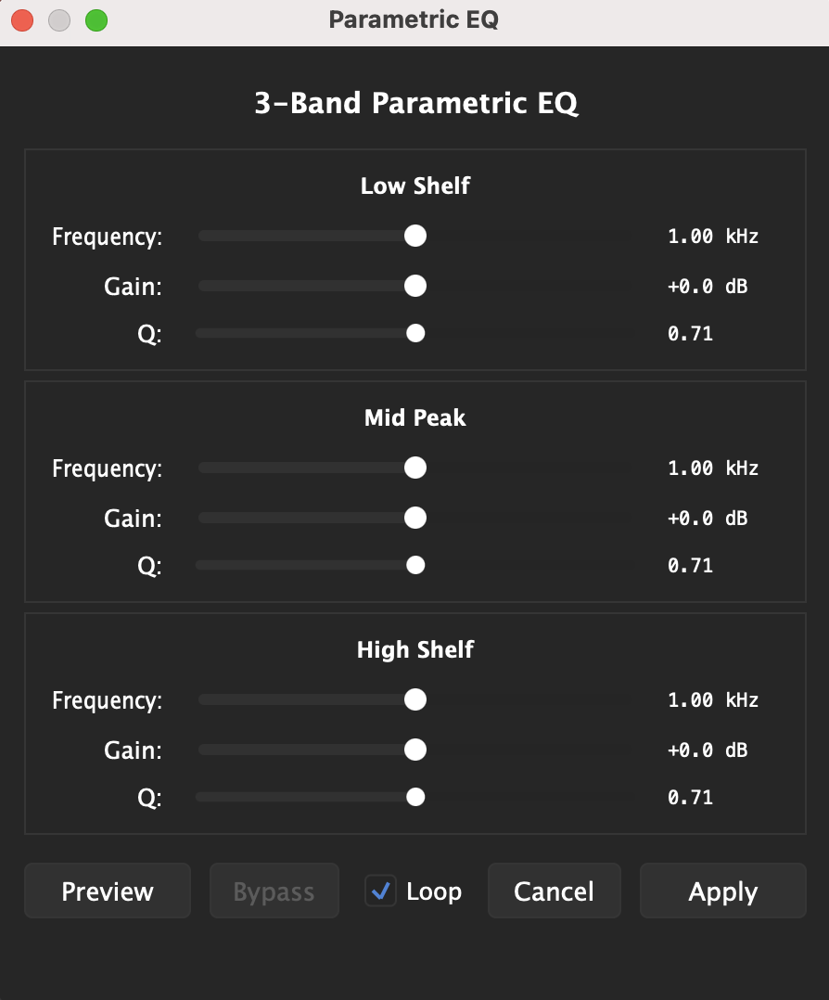
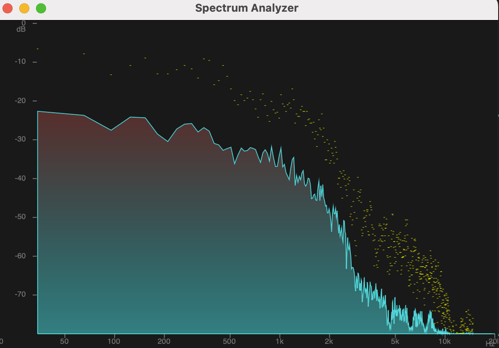
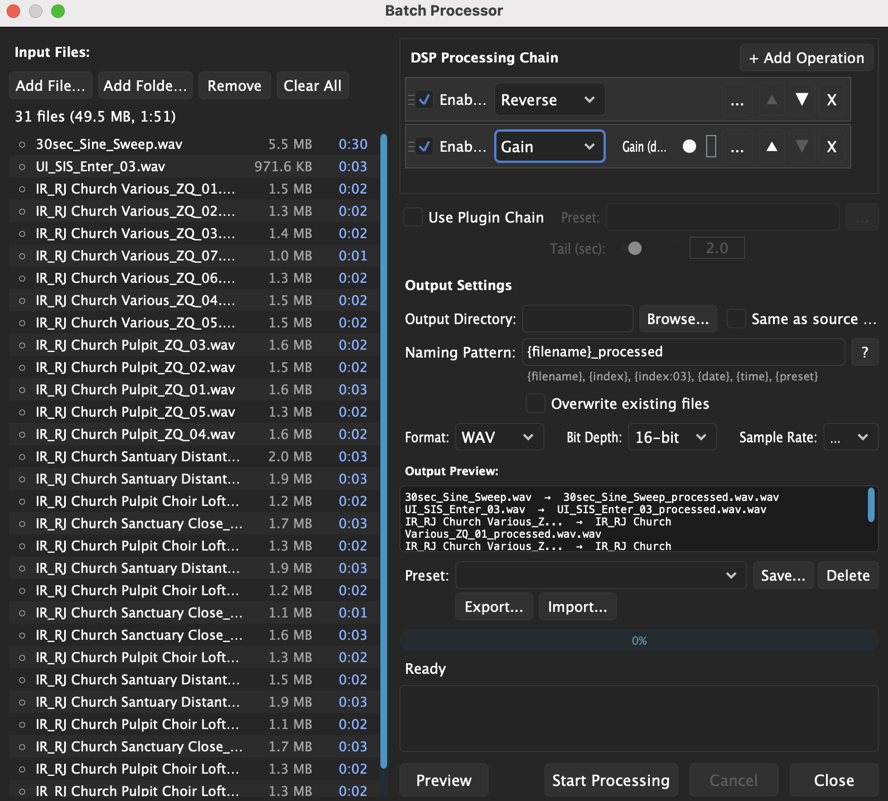

# WaveEdit by ZQ SFX

> A fast, sample-accurate, cross-platform audio editor inspired by Sound Forge Pro

[](https://www.gnu.org/licenses/gpl-3.0)
[](https://juce.com/)
[](https://github.com/themightyzq/WaveEdit/actions/workflows/build.yml)

**Developer**: ZQ SFX
**Copyright**: © 2025-2026 ZQ SFX
**License**: GPL v3

---

## Overview

**WaveEdit** is a professional audio editor designed for speed, precision, and keyboard-driven workflow. Built with JUCE and inspired by Sound Forge Pro, WaveEdit focuses on getting your audio editing done fast without friction.

### Why WaveEdit?

- **Instant startup**: Sub-1 second cold start, no splash screens, no project files
- **Sample-accurate editing**: Professional-grade precision
- **Keyboard-first**: Every action has a shortcut (Sound Forge layout by default)
- **Fully customizable**: Remap any keyboard shortcut
- **Cross-platform**: Native builds for Windows, macOS, and Linux
- **Free and open source**: GPL v3 license

**Perfect for**: Audio engineers, podcasters, sound designers, game developers

---

## Screenshots

### Main window


Waveform, transport controls, selection markers with duration readout,
and the status bar showing sample rate, channel count, bit depth,
length, snap mode, time format, and zoom.

### Region List


Color-coded region browser with name/start/end/duration columns,
in-place search, and one-click Batch Rename. `Cmd+Shift+R` to open.

### Parametric EQ


Low Shelf / Mid Peak / High Shelf with frequency, gain, and Q
controls. The standardised footer (Preview · Bypass · Loop · Cancel ·
Apply) is shared across every Process dialog. `Shift+E` to open.

### Spectrum Analyzer


Real-time FFT with logarithmic frequency axis (20 Hz – 20 kHz), peak
hold (yellow), and a colour gradient from low to high magnitude.
`Cmd+Alt+S` toggles it on while playback runs.

### Batch Processor


Apply a DSP chain (gain, normalise, fades, EQ presets, plugin chain)
to many files at once with output naming patterns, format/bit-depth/
sample-rate conversion, and savable presets. `Cmd+B` to open.

---

## Quick Start

### Launch the App

**Already built?**
```bash
# macOS
open ./build/WaveEdit_artefacts/Release/WaveEdit.app

# OR use the script
./build-and-run.command run-only
```

**Not built yet?**
```bash
./build-and-run.command
```

### Basic Usage

1. **Open**: Drag & drop WAV file or press `Cmd+O`
2. **Select**: Click and drag on waveform
3. **Edit**: `Delete`, `Cmd+X` (cut), `Cmd+C` (copy), `Cmd+V` (paste)
4. **Play**: Press `Space`
5. **Save**: Press `Cmd+S`

No project files, no import wizards. Just open → edit → save.

---

## Features

### What Works Now

**Core Editing**:
- ✅ Multi-file support with tab-based UI
- ✅ Cut, copy, paste, delete
- ✅ Per-channel editing (double-click to focus individual channels)
- ✅ Undo/redo (100 levels per file)
- ✅ Drag & drop multiple files
- ✅ Save/Save As with error handling

**Playback**:
- ✅ Play, pause, stop, loop
- ✅ Selection-bounded playback
- ✅ Real-time level meters (peak, RMS, clipping detection)
- ✅ Real-time spectrum analyzer (FFT-based frequency visualization)

**DSP Operations**:
- ✅ Gain adjustment (±1dB with `Shift+Up/Down`)
- ✅ 3-band Parametric EQ (Low/Mid/High shelves)
- ✅ 20-band Graphical EQ (Bell, Shelf, Cut, Notch, Bandpass filters with real-time curve)
- ✅ Normalize (0dB peak)
- ✅ Fade in/out with 4 curve types (Linear, Exponential, Logarithmic, S-Curve) and visual preview
- ✅ DC offset removal
- ✅ Silence selection
- ✅ Trim (delete outside selection)

**Regions** 🆕:
- ✅ Create, rename, delete, navigate
- ✅ Region list panel with search/filter
- ✅ Batch rename (pattern/find-replace/prefix-suffix)
- ✅ Batch export (each region as separate WAV)
- ✅ Merge/split/copy/paste regions
- ✅ Edit boundaries with snap to zero crossings

**Metadata** 🆕:
- ✅ BWF (Broadcast Wave Format) support
- ✅ iXML metadata with UCS v8.2.1 categories (753 mappings)
- ✅ SoundMiner Extended fields (FXName, Description, Keywords, Designer)
- ✅ File Properties dialog (`Cmd+Enter`) with UCS suggestions
- ✅ Persistent metadata embedded in WAV files

**Navigation**:
- ✅ Sample-accurate selection at any zoom
- ✅ Snap modes: Off, Samples, Ms, Seconds, Frames, Zero
- ✅ Keyboard navigation honors snap mode
- ✅ Go to position (6 time formats supported)

**Keyboard Shortcuts**:
- ✅ Sound Forge Pro compatibility (default)
- ✅ Fully customizable with GUI editor
- ✅ 3 built-in templates (Default, Sound Forge, Pro Tools)
- ✅ Import/export custom templates

**Quality**:
- ✅ Automated test suite (320 groups / ~184,800 assertions locally;
  CI runs 290 groups / ~182,500 with 6 device-dependent groups skipped,
  100% pass rate as of 2026-04-30). Runs locally via
  `./build-and-run.command` and in CI on every push.
- ✅ Sub-1 second startup, 60fps rendering
- ✅ <10ms waveform updates, <10ms playback latency

> **Status**: Production-quality for core editing workflows.

**Spectrum Analyzer** 🆕:
- ✅ Real-time FFT visualization during playback
- ✅ Configurable FFT size (512, 1024, 2048, 4096, 8192 samples)
- ✅ Multiple windowing functions (Hann, Hamming, Blackman, Rectangular)
- ✅ Logarithmic frequency scale (20Hz-20kHz) with peak hold
- ✅ Color gradient visualization (blue → green → yellow → red for magnitude)
- ✅ Toggle with `Cmd+Alt+S` or View → Spectrum Analyzer
- ✅ Configure FFT size and window function from View menu submenus

**Batch Processor** 🆕:
- ✅ Process multiple audio files with identical DSP settings (`Cmd+Alt+B`)
- ✅ DSP chain: Gain, Normalize, DC Offset, Fade In/Out, EQ presets
- ✅ Plugin chain support (apply VST3/AU effect chains)
- ✅ Output settings: directory, naming patterns, sample rate/bit depth conversion
- ✅ Error handling: stop on error, continue, or skip and log
- ✅ Save/load batch presets for recurring workflows

### What's Next

Planned features:
- Additional DSP operations (reverb, compressor, noise reduction)
- More export formats
- Plugin preset management improvements

---

## Installation

### Pre-built binaries

Tagged Releases are published automatically by GitHub Actions when a
`v*` tag is pushed. Grab the latest from the
[Releases page](https://github.com/themightyzq/WaveEdit/releases) —
download the archive for your platform, extract, and run.

The binaries are **unsigned**. WaveEdit is a personal-scale project and
does not currently ship signed binaries; to launch on macOS or Windows
you'll have to bypass the OS's first-run warning once:

- **macOS**: right-click `WaveEdit.app` → **Open** → **Open**. macOS
  remembers the choice; subsequent launches behave normally. (Or:
  `xattr -dr com.apple.quarantine /Applications/WaveEdit.app` from a
  terminal.)
- **Windows**: SmartScreen will say "Windows protected your PC". Click
  **More info** → **Run anyway**.
- **Linux**: `chmod +x WaveEdit` and run.

All builds bundle the LAME MP3 encoder, libFLAC, and Ogg Vorbis. No
extra install steps are required.

If you'd rather build from source (or you want to grab the
work-in-progress build between releases, available as a 30-day
artifact under [Actions](https://github.com/themightyzq/WaveEdit/actions/workflows/build.yml)),
follow the developer steps below.

### Build from Source (For Developers)

**Prerequisites**:
- CMake 3.15+
- C++17 compiler
- JUCE 7.x (included as submodule)
- **LAME library** (for MP3 encoding support)

**Quick build** (recommended):
```bash
git clone https://github.com/themightyzq/WaveEdit.git
cd WaveEdit
./build-and-run.command
```

**Additional options**:
```bash
./build-and-run.command              # Build and launch
./build-and-run.command run-only     # Launch without building
./build-and-run.command clean        # Clean build
./build-and-run.command debug        # Debug build
./build-and-run.command help         # Show all options
```

**Manual build** (if you prefer CMake commands directly):
```bash
git clone https://github.com/themightyzq/WaveEdit.git
cd WaveEdit
git submodule update --init --recursive

mkdir build && cd build
cmake .. -DCMAKE_BUILD_TYPE=Release
cmake --build . --config Release

# Launch
open ./WaveEdit_artefacts/Release/WaveEdit.app  # macOS
./WaveEdit_artefacts/Release/WaveEdit           # Linux
.\WaveEdit_artefacts\Release\WaveEdit.exe       # Windows
```

**Developer dependencies**:

macOS:
```bash
# Xcode command line tools
xcode-select --install

# LAME MP3 encoder (required for MP3 support)
brew install lame
```

Linux (Ubuntu/Debian):
```bash
# Build tools and audio dependencies
sudo apt-get install build-essential cmake libasound2-dev \
    libjack-jackd2-dev libfreetype6-dev libx11-dev libxrandr-dev \
    libxinerama-dev libxcursor-dev libgl1-mesa-dev

# LAME MP3 encoder (required for MP3 support)
sudo apt-get install libmp3lame-dev
```

Windows:
- Visual Studio 2017+ (open generated `.sln` file)
- LAME MP3 encoder: Download from https://lame.sourceforge.io/

**Note for developers**: LAME is only required for building from source. Release builds automatically bundle LAME, so end users don't need to install it separately.

---

## Testing

**Build and run tests**:
```bash
cmake --build build --target WaveEditTests
./build/WaveEditTests_artefacts/Debug/WaveEditTests
```

**Test output**:
```
╔══════════════════════════════════════════════════════════════╗
║         WaveEdit Automated Test Suite by ZQ SFX             ║
╚══════════════════════════════════════════════════════════════╝

Total test groups: 320
Total assertions: 184800
Passed: 184800
Failed: 0

✅ All tests PASSED
```

**Test infrastructure**:
- Unit tests: Individual components (AudioEngine, AudioBufferManager, etc.)
- Integration tests: Components working together
- End-to-end tests: Complete workflows (open → edit → save)

---

## Keyboard Shortcuts

All shortcuts are customizable. The default layout (`Default.json`) is
the source of truth; the table below is generated from it. On
Windows/Linux, replace `Cmd` with `Ctrl`.

To see, search, or remap shortcuts inside the app: `Cmd+/` opens the
shortcut reference and `Cmd+,` → Keyboard Shortcuts tab opens the
editor.

### File
| Action | Shortcut |
|--------|----------|
| New File | `Cmd+N` |
| Open File | `Cmd+O` |
| Save | `Cmd+S` |
| Save As | `Cmd+Shift+S` |
| File Properties | `Alt+Enter` |
| Edit BWF Metadata | `Cmd+Alt+B` |
| Preferences | `Cmd+,` |
| Quit | `Cmd+Q` |

### Selection
| Action | Shortcut |
|--------|----------|
| Select All | `Cmd+A` |
| Extend selection (by snap) | `Shift+Left/Right` |
| Extend to visible start/end | `Shift+Home/End` |
| Extend by page | `Shift+PageUp/PageDown` |

### Editing
| Action | Shortcut |
|--------|----------|
| Cut | `Cmd+X` |
| Copy | `Cmd+C` |
| Paste | `Cmd+V` |
| Delete | `Delete` |
| Silence Selection | `Shift+Alt+S` |
| Trim (delete outside selection) | `Cmd+T` |
| Undo | `Cmd+Z` |
| Redo | `Cmd+Shift+Z` |

### Playback
| Action | Shortcut |
|--------|----------|
| Play | `Space` |
| Pause | `Enter` |
| Stop | `Escape` |
| Toggle Loop | `L` |
| Loop Region | `Cmd+Shift+L` |
| Record | `Cmd+R` |

### Navigation
| Action | Shortcut |
|--------|----------|
| Move cursor (honors snap) | `Left/Right` |
| Jump to start/end | `Cmd+Left/Right` |
| Jump to visible start/end | `Home/End` |
| Page left/right | `PageUp/PageDown` |
| Center view on cursor | `.` |
| Go to Position | `Cmd+Shift+G` |

### Zoom
| Action | Shortcut |
|--------|----------|
| Zoom In | `Cmd+=` |
| Zoom Out | `Cmd+-` |
| Zoom to Selection | `Cmd+E` |
| Zoom to Region | `Cmd+Alt+Z` |
| Zoom to Fit | `Cmd+Shift+0` |
| Zoom 1:1 | `Cmd+0` |

### Snap & Time
| Action | Shortcut |
|--------|----------|
| Cycle Snap Mode | `T` |
| Toggle Zero-Crossing Snap | `Z` |
| Cycle Time Format | `Shift+T` |

### Processing (DSP)
| Action | Shortcut |
|--------|----------|
| Gain Dialog | `G` |
| Increase Gain (+1 dB) | `Shift+Up` |
| Decrease Gain (-1 dB) | `Shift+Down` |
| Normalize | `Cmd+G` |
| Fade In | `Cmd+F` |
| Fade Out | `Cmd+Shift+O` |
| DC Offset Removal | `Cmd+Shift+D` |
| Parametric EQ | `Shift+E` |
| Graphical EQ | `Cmd+Alt+E` |
| Channel Converter | `Cmd+Shift+U` |
| Batch Processor | `Cmd+B` |

### Plugins
| Action | Shortcut |
|--------|----------|
| Show Plugin Chain | `Cmd+Shift+P` |
| Apply Plugin Chain | `Cmd+P` |

### Regions
| Action | Shortcut |
|--------|----------|
| Add Region | `R` |
| Strip Silence to Regions | `Shift+R` |
| Region List Panel | `Cmd+Shift+R` |
| Batch Rename | `Cmd+Shift+B` |
| Batch Export | `Cmd+Alt+R` |
| Merge Regions | `Cmd+J` |
| Split Region | `Cmd+K` |
| Copy Regions | `Cmd+Alt+C` |
| Paste Regions | `Cmd+Alt+V` |
| Delete Region | `Cmd+Delete` |
| Next / Previous Region | `]` / `[` |
| Select All Regions | `Cmd+Alt+A` |
| Invert Region Selection | `Cmd+Shift+I` |
| Nudge Region Start | `Cmd+Alt+Left/Right` |
| Nudge Region End | `Shift+Alt+Left/Right` |
| Edit Boundaries | Right-click → Edit Boundaries |

### Markers
| Action | Shortcut |
|--------|----------|
| Add Marker | `M` |
| Marker List Panel | `Cmd+Shift+K` |
| Next Marker | `Shift+]` |
| Previous Marker | `Shift+[` |
| Delete Marker | `Cmd+Shift+Delete` |

### View
| Action | Shortcut |
|--------|----------|
| Auto-Scroll | `Cmd+Shift+F` |
| Auto-Preview Regions | `Cmd+Alt+P` |
| Spectrum Analyzer | `Cmd+Alt+S` |

### Tabs
| Action | Shortcut |
|--------|----------|
| Next Tab | `Ctrl+Tab` |
| Previous Tab | `Ctrl+Shift+Tab` |
| Close Tab | `Cmd+W` |
| Close All Tabs | `Cmd+Shift+W` |
| Select Tab 1-9 | `Cmd+1` … `Cmd+9` |

### Help
| Action | Shortcut |
|--------|----------|
| Keyboard Shortcuts Reference | `Cmd+/` |
| Command Palette | `Cmd+Shift+A` |

> **Note**: `Cmd` key on macOS = `Ctrl` key on Windows/Linux.

---

## Configuration

All user state — `settings.json`, plugin scan caches, keymaps,
toolbars, batch presets, autosave files — lives under a single
parent directory:

- macOS: `~/Library/Application Support/WaveEdit/`
- Windows: `%APPDATA%\WaveEdit\`
- Linux: `~/.config/WaveEdit/`

**Top-level files**: `settings.json` (recent files, audio device,
auto-save), `plugins.xml`, `plugin_blacklist.txt`,
`custom_plugin_paths.txt`, `plugin_incremental_cache.xml`,
`scan_log.txt`.

**Subfolders**: `autosave/` (in-progress auto-saves),
`Keymaps/` (built-in + user keyboard templates),
`Toolbars/` (toolbar layouts),
`Presets/Batch/` (batch processor presets).

**Migration note (macOS)**: builds before 2026-04-29 wrote
`settings.json` and the plugin scan cache to `~/Library/WaveEdit/`
instead of the canonical Application Support path. On first launch
the new build copies anything from the legacy location into the new
one and leaves the old folder in place as a backup; you can
`rm -rf ~/Library/WaveEdit` once you've confirmed your recents and
plugin list look right.

**UI preferences (window size, dB scale, refresh rate)**:
- macOS: `~/Library/Preferences/com.waveedit.app.plist` (managed by
  the system; use `defaults read com.waveedit.app` to inspect).
- Windows / Linux: stored alongside `settings.json` above.

**Application log** — useful when reporting bugs:
- macOS: `~/Library/Logs/WaveEdit/WaveEdit.log`
- Windows: `%APPDATA%\WaveEdit\WaveEdit.log`
- Linux: `~/.config/WaveEdit/WaveEdit.log`

The log records startup, audio-device init, errors, and unsaved-changes
events. Attach it when filing an issue.

**Crash reports**: if WaveEdit hits a fatal signal, a single
timestamped report (time, version, OS, stack backtrace) is written
next to the session log under a `crashes/` subfolder
(e.g. `~/Library/Logs/WaveEdit/crashes/crash-YYYY-MM-DD_HH-MM-SS.txt`).
Attach the most recent one when reporting a crash.

**To uninstall completely (macOS)**:
```bash
# Quit WaveEdit first, then:
rm -rf "~/Library/Application Support/WaveEdit"
rm -rf ~/Library/Logs/WaveEdit
rm -rf ~/Library/WaveEdit         # legacy path; only if you used a pre-2026-04-29 build
defaults delete com.waveedit.app
# Optional: remove the app bundle itself
rm -rf /Applications/WaveEdit.app
```

> Customizing keyboard shortcuts? Open Preferences (`Cmd+,`) →
> Keyboard Shortcuts tab. There is no `keybindings.json` — keymap
> templates live as named JSON files inside `Keymaps/`.

---

## Development

### Tech Stack

- **Framework**: [JUCE 7.x](https://juce.com/)
- **Language**: C++17
- **Build System**: CMake
- **Audio I/O**: JUCE audio engine (CoreAudio/WASAPI/ALSA)

### Contributing

1. Open an issue before major work
2. Follow coding standards below
3. Write tests for new features
4. Update documentation

**Coding standards**:
- C++17 or later
- 4-space indentation, Allman braces
- PascalCase classes, camelCase methods
- Document all public methods

**Pull request process**:
1. Fork the repository
2. Create feature branch (`feature/your-feature`)
3. Follow [Conventional Commits](https://www.conventionalcommits.org/)
4. Push to your fork
5. Open pull request with clear description

### Performance Targets

- Startup: <1 second
- File load (10min WAV): <2 seconds
- Rendering: 60fps
- Playback latency: <10ms
- Save: <500ms

---

## FAQ

**Q: Why JUCE instead of Electron/Tauri?**
A: JUCE is purpose-built for audio with sample-accurate timing and low-latency I/O that web frameworks can't match.

**Q: Will you add multi-track editing?**
A: No. WaveEdit is a stereo/mono editor, not a DAW. Use Reaper or Ardour for multi-track.

**Q: Can I use WaveEdit commercially?**
A: Yes! GPL v3 allows commercial use.

**Q: How do I customize keyboard shortcuts?**
A: Open Preferences (`Cmd+,`) → Keyboard Shortcuts tab.

**Q: Does WaveEdit support destructive editing?**
A: Non-destructive with undo/redo. Original file only overwritten when you save.

---

## License

GNU General Public License v3.0

- ✅ Use for any purpose (personal, commercial)
- ✅ Modify and distribute
- ✅ Must distribute source code with binaries
- ✅ Derivative works must also be GPL v3

See [LICENSE](LICENSE) for full details.

---

## Credits

**Developed by**: ZQ SFX

**Built with**:
- [JUCE](https://juce.com/) - Cross-platform C++ framework
- Inspired by [Sound Forge Pro](https://www.magix.com/us/music-editing/sound-forge/)

**Thanks to**:
- JUCE community
- Sound Forge Pro for setting the standard
- All contributors and testers

---

## Contact

- **Issues**: [GitHub Issues](https://github.com/themightyzq/WaveEdit/issues)
- **Discussions**: [GitHub Discussions](https://github.com/themightyzq/WaveEdit/discussions)

---

**Version**: 0.1.0
**Last Updated**: 2026-04-30
