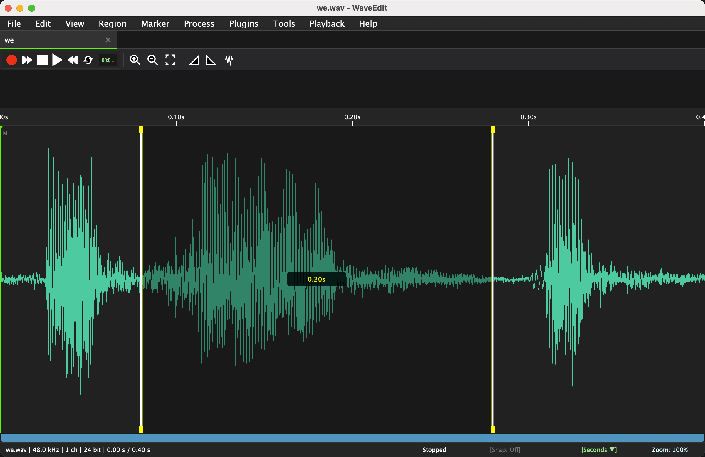

# WaveEdit

WaveEdit is a standalone audio file editor for macOS, Windows, and Linux, in the style of
Sound Forge. It edits one file at a time: there is no project format, no timeline of clips,
and no multi-track mixing. Editing is sample-accurate and keyboard-first, with every action
bound to a shortcut. It opens WAV, AIFF, FLAC, MP3, OGG, and M4A. Built with JUCE.

## Install

Download a build from the Releases page:
https://github.com/themightyzq/WaveEdit/releases

The latest tagged release is v0.1.0 (2026-04-29), with archives for each platform:
`WaveEdit-macOS-universal.zip`, `WaveEdit-Windows-x64.zip`, `WaveEdit-Linux-x64.tar.gz`.
The source in this repository has moved on since then and is currently at 0.9.0. If you want
the current version rather than v0.1.0, build from source (below).

Despite its filename, the v0.1.0 macOS zip is an Apple Silicon (arm64) build only and will
not run on an Intel Mac. Building from source produces a build for the Mac you build on;
a universal build needs LAME and SoundTouch compiled for both architectures, which Homebrew
does not provide.

The binaries are unsigned on every platform:

- macOS: right-click `WaveEdit.app`, choose Open, then Open again. macOS remembers the
  choice after that. (Or run `xattr -dr com.apple.quarantine /Applications/WaveEdit.app`
  from a terminal.)
- Windows: SmartScreen will say "Windows protected your PC". Click "More info", then
  "Run anyway".
- Linux: `chmod +x WaveEdit` and run it.

Each build bundles the LAME MP3 encoder, SoundTouch, libFLAC, and Ogg Vorbis, so no extra
libraries are needed.

WaveEdit keeps its settings, keymaps, plugin scan cache, batch presets, and autosave files
in one folder, so removing that folder plus the app is a complete uninstall:

- macOS: `~/Library/Application Support/WaveEdit/`
- Windows: `%APPDATA%\WaveEdit\`
- Linux: `~/.config/WaveEdit/`

## Use

1. Open a file: drag and drop it onto the window, press `Cmd+O`, or double-click a
   WAV/AIFF/FLAC/OGG/MP3 file with WaveEdit set as the handler ("Open With -> WaveEdit").
   On macOS, M4A/AAC files open too, read only; saving one re-encodes to WAV, AIFF, FLAC,
   OGG, or MP3. Each open file is its own tab in one window.
2. Select audio by clicking and dragging on the waveform.
3. Edit with `Delete`, `Cmd+X`/`Cmd+C`/`Cmd+V` for cut/copy/paste, and `Cmd+Z`/`Cmd+Shift+Z`
   for undo/redo (100 levels per file).
4. Play with `Space`, stop with `Escape`.
5. Save with `Cmd+S`. There are no project files: WaveEdit edits the file itself, and
   nothing is written to disk until you save.

What it does, beyond basic cut and paste:

- 20-band graphical EQ (bell, shelf, cut, notch, and bandpass filters, with a real-time
  curve)
- Normalize (peak or RMS), gain adjustment, DC offset removal
- Fade in and fade out, with linear, exponential, logarithmic, and S-curve shapes
- Reverse, invert polarity, resample, time-stretch and pitch-shift (via SoundTouch, tempo
  and pitch independent)
- Regions and markers, saved as embedded WAV cue and LIST-adtl chunks so they read back in
  Reaper, Wwise, and iZotope RX, plus a region list panel, batch rename, and batch export
  (each region to its own WAV file)
- BWF and iXML metadata editing, with UCS category suggestions
- A batch processor: apply a DSP chain (gain, normalize, fades, EQ presets, a plugin chain)
  to many files at once, with output format and naming control
- Hosts VST3 and AU effect plugins in a chain, with parameter automation recording and a
  lane editor
- Crash recovery: autosave runs every minute on a modified file, and is offered back the
  next time you open it
- Three built-in themes: Dark, Light, and High Contrast
- Sound Forge and Pro Tools keymap templates, and every shortcut can be remapped

Keyboard shortcuts you will use constantly (Windows and Linux use `Ctrl` where macOS uses
`Cmd`):

| Action | Shortcut |
|--------|----------|
| Open | `Cmd+O` |
| Save | `Cmd+S` |
| Play / Stop | `Space` / `Escape` |
| Cut / Copy / Paste | `Cmd+X` / `Cmd+C` / `Cmd+V` |
| Undo / Redo | `Cmd+Z` / `Cmd+Shift+Z` |
| Select All | `Cmd+A` |
| Zoom to Selection | `Cmd+E` |
| Add Region | `R` |
| Add Marker | `M` |
| Normalize | `Cmd+G` |

The rest of the shortcuts (there are several dozen more, covering navigation, zoom,
processing, regions, markers, and plugins) are listed inside the app: press `Cmd+/` to open
the shortcut reference, or `Cmd+,` and go to the Keyboard Shortcuts tab to remap any of them.



## Keyboard shortcuts

Every shortcut is remappable. The defaults come from `Templates/Keymaps/Default.json`,
which is the source of truth; the tables below are checked against it in CI. On Windows and
Linux, read `Cmd` as `Ctrl`. Inside the app, `Cmd+/` opens the shortcut reference and
`Cmd+,` then the Keyboard Shortcuts tab opens the editor.


### File
| Action | Shortcut |
|--------|----------|
| New File | `Cmd+N` |
| Open File | `Cmd+O` |
| Save | `Cmd+S` |
| Save As | `Cmd+Shift+S` |
| File Properties | `Alt+Enter` |
| Edit BWF Metadata | `Cmd+Alt+B` |
| Edit iXML Metadata | `Cmd+Alt+X` |
| Preferences | `Cmd+,` |
| Quit | `Cmd+Q` |

### Selection
| Action | Shortcut |
|--------|----------|
| Select All | `Cmd+A` |
| Mark In | `I` |
| Mark Out | `O` |
| Extend selection (by snap) | `Shift+Left/Right` |
| Extend to visible start/end | `Shift+Home/End` |
| Extend by page | `Shift+PageUp/PageDown` |

### Editing
| Action | Shortcut |
|--------|----------|
| Cut | `Cmd+X` |
| Copy | `Cmd+C` |
| Paste | `Cmd+V` |
| Delete | `Delete` |
| Silence Selection | `Shift+Alt+S` |
| Trim (delete outside selection) | `Cmd+T` |
| Undo | `Cmd+Z` |
| Redo | `Cmd+Shift+Z` |

### Playback
| Action | Shortcut |
|--------|----------|
| Play | `Space` |
| Pause | `Enter` |
| Stop | `Escape` |
| Toggle Loop | `L` |
| Loop Region | `Cmd+Shift+L` |
| Record | `Cmd+R` |

### Navigation
| Action | Shortcut |
|--------|----------|
| Move cursor (honors snap) | `Left/Right` |
| Jump to start/end | `Cmd+Left/Right` |
| Jump to visible start/end | `Home/End` |
| Page left/right | `PageUp/PageDown` |
| Center view on cursor | `.` |
| Go to Position | `Cmd+Shift+G` |

### Zoom
| Action | Shortcut |
|--------|----------|
| Zoom In | `Cmd+=` |
| Zoom Out | `Cmd+-` |
| Zoom to Selection | `Cmd+E` |
| Zoom to Region | `Cmd+Alt+Z` |
| Zoom to Fit | `Cmd+Shift+0` |
| Zoom 1:1 | `Cmd+0` |

### Snap & Time
| Action | Shortcut |
|--------|----------|
| Cycle Snap Mode | `T` |
| Toggle Zero-Crossing Snap | `Z` |
| Cycle Time Format | `Shift+T` |

### Processing (DSP)
| Action | Shortcut |
|--------|----------|
| Gain Dialog | `G` |
| Increase Gain (+1 dB) | `Shift+Up` |
| Decrease Gain (-1 dB) | `Shift+Down` |
| Normalize | `Cmd+G` |
| Fade In | `Cmd+F` |
| Fade Out | `Cmd+Shift+O` |
| DC Offset Removal | `Cmd+Shift+D` |
| Graphical EQ | `Cmd+Alt+E` |
| Reverse | `Ctrl+R` |
| Invert Polarity | `Ctrl+I` |
| Resample | `Ctrl+Shift+R` |
| Time Stretch | `Ctrl+Shift+T` |
| Pitch Shift | `Ctrl+Shift+P` |
| Channel Converter | `Cmd+Shift+U` |
| Batch Processor | `Cmd+B` |

### Tools
| Action | Shortcut |
|--------|----------|
| Channel Extractor | `Cmd+Shift+X` |
| Head & Tail Editor | `Ctrl+H` |
| Looping Tools | `Cmd+L` |

### Generate
| Action | Shortcut |
|--------|----------|
| Insert Silence | `Cmd+Shift+M` |
| Generate Tone | `Cmd+Shift+T` |
| Generate Noise | `Cmd+Shift+N` |

### Plugins
| Action | Shortcut |
|--------|----------|
| Show Plugin Chain | `Cmd+Shift+P` |
| Apply Plugin Chain | `Cmd+P` |
| Offline Plugin Processing | `Ctrl+Shift+O` |
| Bypass All Plugins | `Ctrl+B` |
| Show Automation Lanes | `Cmd+Alt+L` |
| Arm Automation Recording | `Ctrl+Shift+A` |

### Regions
| Action | Shortcut |
|--------|----------|
| Add Region | `R` |
| Strip Silence to Regions | `Shift+R` |
| Region List Panel | `Cmd+Shift+R` |
| Batch Rename | `Cmd+Shift+B` |
| Batch Export | `Cmd+Alt+R` |
| Merge Regions | `Cmd+J` |
| Split Region | `Cmd+K` |
| Copy Regions | `Cmd+Alt+C` |
| Paste Regions | `Cmd+Alt+V` |
| Delete Region | `Cmd+Delete` |
| Next / Previous Region | `]` / `[` |
| Select All Regions | `Cmd+Alt+A` |
| Invert Region Selection | `Cmd+Shift+I` |
| Convert Regions to Markers | `Ctrl+Shift+G` |
| Nudge Region Start | `Cmd+Alt+Left/Right` |
| Nudge Region End | `Shift+Alt+Left/Right` |
| Edit Boundaries | Right-click , then Edit Boundaries |

### Markers
| Action | Shortcut |
|--------|----------|
| Add Marker | `M` |
| Marker List Panel | `Cmd+Shift+K` |
| Next Marker | `Shift+]` |
| Previous Marker | `Shift+[` |
| Delete Marker | `Cmd+Shift+Delete` |
| Convert Markers to Regions | `Ctrl+Shift+M` |

### View
| Action | Shortcut |
|--------|----------|
| Auto-Scroll | `Cmd+Shift+F` |
| Auto-Preview Regions | `Cmd+Alt+P` |
| Spectrum Analyzer | `Cmd+Alt+S` |
| Toggle Region Overlay | `Cmd+Shift+H` |

### Tabs
| Action | Shortcut |
|--------|----------|
| Next Tab | `Ctrl+Tab` |
| Previous Tab | `Ctrl+Shift+Tab` |
| Close Tab | `Cmd+W` |
| Close All Tabs | `Cmd+Shift+W` |
| Select Tab 1-9 | `Cmd+1` to `Cmd+9` |

### Toolbar
| Action | Shortcut |
|--------|----------|
| Customize Toolbar | `Ctrl+Shift+K` |
| Reset Toolbar | `Ctrl+Shift+J` |

### Help
| Action | Shortcut |
|--------|----------|
| Keyboard Shortcuts | `Cmd+/` |
| Command Palette | `Cmd+Shift+A` |


## Build from source

Requirements: CMake 3.15 or newer, a C++17 compiler (Xcode command-line tools on macOS,
Visual Studio 2017 or newer on Windows), the LAME library, and SoundTouch.

JUCE is included as a submodule, so fetch it along with the clone:

```
git clone https://github.com/themightyzq/WaveEdit.git
cd WaveEdit
git submodule update --init --recursive
```

Then build:

```
mkdir build && cd build
cmake .. -DCMAKE_BUILD_TYPE=Release
cmake --build . --config Release
```

The app is written to `build/WaveEdit_artefacts/Release/`. On macOS, `./build-and-run.command`
runs the same steps and launches it; pass `clean` or `debug` for a clean or debug build.

Platform dependencies:

macOS:
```
xcode-select --install
brew install lame
brew install sound-touch
```

Linux (Ubuntu/Debian):
```
sudo apt-get install build-essential cmake libasound2-dev libjack-jackd2-dev \
    libfreetype6-dev libx11-dev libxrandr-dev libxinerama-dev libxcursor-dev \
    libgl1-mesa-dev libmp3lame-dev libsoundtouch-dev
```

Windows:
- Visual Studio 2017 or newer (open the generated `.sln`)
- LAME: download from https://lame.sourceforge.io/
- SoundTouch: download from https://www.surina.net/soundtouch/

LAME and SoundTouch are only needed to build from source. Release binaries bundle both.

## Licence

GPL-3.0-or-later. Built with JUCE. See `LICENSE`.

ZQ SFX, https://www.zq-sfx.com, connect@zq-sfx.com.
